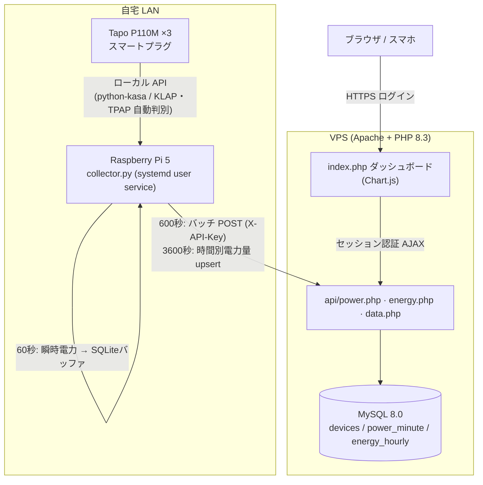

# tapo-power-monitor

TP-Link **Tapo P110M** スマートプラグの電力データを Raspberry Pi でローカル収集し、VPS 上の自作ダッシュボードで可視化するセルフホスト型の電力モニタリングシステム。

Tapo の公式クラウド API は非公開で、消費電力データはアプリからしか見られず書き出しもできない。本プロジェクトは**ローカル LAN 経由でプラグから直接データを取得**し、独自に蓄積してブラウザから閲覧・分析できるようにする。


## 主な機能

- **1分粒度の瞬時電力(W)収集** — LAN 内のプラグを毎分ポーリングし、電子レンジやコンプレッサの ON/OFF まで見える細かさで記録
- **欠損に強い電力量(kWh)** — プラグ本体が保持する時間別電力量履歴を毎時取得して upsert。収集側が一時停止しても時間別の値は後追いで補完される
- **無限スクロールのグラフ** — 瞬時電力チャートはドラッグでパン・ホイール/ピンチでズーム。左端に近づくと過去データを自動で遅延ロードし、いくらでも遡れる
- **推定電気代の表示** — 日別電力量に円換算(単価は設定可能)。左軸 kWh / 右軸 ¥ の二軸表示＋期間合計サマリー
- **DHCP でも止まらない IP 自動追従** — 接続失敗時のみ LAN discovery を行い MAC で機器を再特定。通常時はオーバーヘッドゼロ
- **ネットワーク断への耐性** — 送信失敗時はローカル SQLite にバッファして復旧後に再送(主キーで重複無害化)
- **認証付きダッシュボード** — パスワードログイン + Remember Me(90日)。スマホ・ダークモード対応
- **収集停止のプッシュ通知** — デバイス単位でデータの鮮度を監視し、途絶と復帰を ntfy.sh へ通知。プロセスの死活監視では拾えない「一部のプラグだけ収集が止まる」障害を検知する

## アーキテクチャ



- **収集(raspi)→ API(server)** は HTTPS + `X-API-Key` ヘッダーで認証
- **ダッシュボード → データ API** はセッション認証(`data.php` は期間指定 `from`/`to` に対応し遅延ロードを支える)

## 技術スタック

| レイヤ | 使用技術 |
|---|---|
| 収集 | Raspberry Pi 5 / Python 3.11 / asyncio / [python-kasa](https://github.com/python-kasa/python-kasa)([TPAP 対応 PR](https://github.com/python-kasa/python-kasa/pull/1592) 版) / systemd user unit |
| バッファ | SQLite |
| API / バックエンド | Apache 2.4 / PHP 8.3 (mod_php) / MySQL 8.0 |
| フロントエンド | Vanilla JS / Chart.js 4 / chartjs-plugin-zoom / hammer.js |

## ディレクトリ構成

```
raspi/                     Raspberry Pi に配置する収集サービス
  collector.py             常駐サービス本体（asyncio、60/600/3600秒の3系統周期タスク）
  test_devices.py          プラグ導通テスト
  requirements.txt         Python 依存
  .env.example             環境変数サンプル（実 .env は .gitignore 済み）
  tapo-collector.service   systemd user unit

server/                    VPS に配置する PHP アプリ
  index.php                ダッシュボード本体（Chart.js）
  auth.php                 認証ガード（セッション + Remember Me）
  login.php / logout.php   ログイン / ログアウト
  check_collector.php      収集停止の監視（cron 実行、ntfy.sh へ通知）
  api/
    db_config.php          DB 接続共通関数（getenv ベース）
    power.php              瞬時電力バッチ受信（X-API-Key、INSERT IGNORE）
    energy.php             時間別電力量受信（ON DUPLICATE KEY UPDATE）
    data.php              ダッシュボード用データ API（セッション認証、期間指定対応）
  sql/
    setup.sql              DB・テーブル・初期データ・アプリ用ユーザー
    setup_dashboard.sql    Remember Me トークンテーブル
    setup_history.sql      過去履歴アーカイブ（energy_daily / energy_monthly）
    setup_tariff.sql       電気料金モデル（段階単価・燃調・再エネ・検針票の実績）

scripts/
  backfill_history.py      デバイス本体が持つ日別・月別統計を SQL として書き出す
  import_tapo_export.py    Tapo アプリのデータエクスポート(.xls) を SQL に変換する
  import_meisai_pdf.py     電気料金請求書のPDFを料金モデル用の SQL に変換する
  deploy_vps_prep.sh       VPS 側の下ごしらえ

docs/
  deploy.md                デプロイ手順（raspi 側・VPS 側・導通確認）
```

## ダッシュボード

| セクション | 内容 |
|---|---|
| 現在の電力カード | デバイスごとの現在 W と当日 kWh。30秒ごと自動更新、無応答はオフライン表示 |
| 瞬時電力チャート | 1h / 6h / 24h プリセット + ドラッグ pan・ズーム・**過去への無限スクロール(遅延ロード)** |
| 時間別 電力量 | 今日 / 7日の kWh 棒グラフ |
| 日別 電力量 | 30日 / 90日 / 1年の積み上げ棒グラフ + **推定電気代(左 kWh / 右 ¥ の二軸)** |
| 月別 電力量 | 12ヶ月 / 24ヶ月の積み上げ棒グラフ + 推定電気代の二軸 |
| 電気代 | 検針期間ごとの家全体 kWh・プラグ3台の**増分コスト**・限界単価・請求額（実績/試算） |

日別・月別は収集開始前の期間をアーカイブから復元して表示する。復元値のバーは**半透明**で描画し、
表では `*` を付けて実測と区別できるようにしてある（下記「過去履歴の合成」を参照）。

金額は一律の単価ではなく、**その日が属する検針期間の限界単価**で換算する。段階制と燃料費調整の
月変動があるため、一律の定数では実態からずれる（実測では 32〜33円/kWh の範囲で動いていた）。

## 設計上のポイント / ハマりどころ

実装中に遭遇した非自明な点と対処:

- **P110M(JP) の暗号方式は KLAP と TPAP の2系統** — FW1.4系はアカウント設定の **マイページ → 音声アシスタント → サードパーティ互換性** が ON なら KLAP、OFF なら TPAP を広告する（アプリのバージョンによりメニュー位置が異なる）。この設定は**アカウント単位**でデバイス個別には切り替えられない
- **FW1.4.3 以降は KLAP 認証が壊れている** — 同じ認証情報で他の個体が通るのに `HASH_MISMATCH` になる。削除→再追加・トグル入れ直し・工場出荷リセット+BLE再ペアのいずれでも直らず、ダウングレードもできない。**互換性を OFF にして TPAP で繋ぐのが唯一の回避策**。TPAP に対応しているのは現時点で [python-kasa の未マージ PR #1592](https://github.com/python-kasa/python-kasa/pull/1592) のみ（`requirements.txt` はこれを直接参照している。本家に取り込まれたら通常版に戻せる）
- **暗号方式の自動判別** — 接続のたび `Discover.discover_single()` を通すことで KLAP / TPAP を自動選択している。互換性トグルをどちらに倒しても収集側のコードは変わらない。ローカル API を遅延起動する個体（ポート80が閉じて見える）を TDP プローブで叩き起こす効果も兼ねる
- **TPAP のハンドシェイクは同時実行できない** — 1台に対して PAKE を同時に2本張ると `pake_share failed: INTERNAL_UNKNOWN_ERROR(-100000)` で両方落ちる。瞬時電力ループと時間別電力量ループが同じデバイスを共有するため、デバイスへのアクセスは `asyncio.Lock` で直列化している（KLAP は同時接続を許容していたので、TPAP に切り替えて初めて顕在化した）
- **電力値の単位** — `get_current_power()` は W 直値、`get_energy_usage().current_power` は mW。サブワット分解能が取れる後者を採用（実機検証済み）
- **時間別履歴の API** — `get_energy_data` は `start_timestamp`/`end_timestamp`(epoch秒) と `interval`(1区間あたりの**分数**、60 = 1時間刻み) を取り、`data` が Wh 配列・`start_timestamp` が1件目の開始時刻。旧来の `start_datetime` とは異なる
- **systemd 配下では `PYTHONUNBUFFERED=1`** — 標準出力が journal へのパイプになると `print()` がブロックバッファされ、数KB溜まるまでログが出てこない
- **過去履歴の合成** — 収集開始前のデータは、デバイス本体が保持している粗い統計（日別 約3ヶ月 / 月別 約1年）と Tapo アプリのデータエクスポートからしか復元できない。これを `energy_daily` / `energy_monthly` に保管し、`data.php` が `energy_hourly` を優先しつつ足りない期間だけフォールバックして合成する。collector はこの2テーブルを触らない（履歴は静的なので、投入は `scripts/` のジェネレータが出す SQL を手動で流す）
- **デバイス統計の取得にはクセがある** — `get_energy_data` の `interval` は「1区間あたりの分数」で、日別(1440)は start/end を暦月境界に、月別(43200)は暦年境界に揃えないと `PARAMS_ERROR(-1008)`。さらに日別は要求した窓が尊重されず保持範囲を丸ごと返してくることがあるため、日付をキーに重複排除が要る
- **エクスポートの末尾1件は途中集計** — アプリのエクスポートは「日」「月」「年」タブの各系列の最後の1件がエクスポート時点までの積算値になる（例: 08:50 に出すと当日の日別値は 08:50 までの値）。日別・月別に取り込む際は末尾を捨てる
- **電気代は「平均単価 × kWh」では出ない** — 基本料金は定額でプラグの消費と無関係、電力量料金は段階制なので後から足した kWh ほど高い段階に乗る。求めるべきは「そのプラグが無かったら請求がいくら減るか」= **増分コスト**で、`段階料金(家全体) − 段階料金(家全体 − プラグ分) + プラグ分 ×(燃調 + 再エネ)`。段階の判定には家全体の使用量が要るため `billing_period`（検針票の実績）と `house_usage_daily` を持つ。料金表を DB 化してあるので、検針票の値と計算値が一致するかダッシュボード上で常時検算できる
- **段階の判定は暦月ではなく「検針期間」単位** — 検針日は毎月ずれる（例: 6/11〜7/12）。暦月で切ると段階の位置がずれるため、`billing_period` に期間の境界を持たせている
- **`kwh` 列は INT UNSIGNED** — 段階の切り出しで `kwh - 300` をそのまま書くと 300 未満のときにアンダーフローして `BIGINT UNSIGNED value is out of range` になる。`CAST(kwh AS SIGNED)` してから引く
- **MySQL 8 `only_full_group_by`** — ダウンサンプルの `GROUP BY 複合式` が拒否されるため、派生テーブルでバケット列を先に作ってから集約
- **Safari の日時パース** — `"YYYY-MM-DD HH:MM:SS"` を `new Date(str.replace(' ','T'))` で渡す
- **chartjs-plugin-zoom の `resetZoom`** — 初回レンダリング範囲に戻る癖があるため、プリセット切替では min/max を明示設定して update する
- **DNS 依存の低減** — 動的 DNS 名の一時的な解決失敗で送信が止まらないよう、収集側は VPS の固定 IP を `/etc/hosts` に固定するのが堅牢（データ自体はバッファ→再送で保護される）

## セットアップ

詳細は [`docs/deploy.md`](docs/deploy.md) を参照。概要:

1. **Raspberry Pi**: `~/tapo/` にコード配置 → venv 作成 → `pip install -r requirements.txt` → `.env` 作成(chmod 600) → systemd user unit を enable
2. **VPS**: `setup.sql` / `setup_dashboard.sql` で DB 構築 → `server/` を配置 → Apache の `SetEnv` で API キー・DB 接続情報・ダッシュボードパスワードを設定 → reload

> リポジトリ内の `.env.example` / `setup.sql` のドメイン・IP・MAC はプレースホルダです。自分の環境の実値に置き換えてください。

## 設定（主な環境変数）

| 変数 | 場所 | 用途 |
|---|---|---|
| `TAPO_EMAIL` / `TAPO_PASSWORD` | raspi `.env` | Tapo アカウント認証 |
| `API_KEY` / `TAPO_API_KEY` | raspi `.env` / VPS Apache | 収集 API の共有キー（英数字のみ推奨） |
| `DEVICES` | raspi `.env` | `device_key:ip:mac` のカンマ区切り |
| `TAPO_DASH_PASSWORD` | VPS Apache | ダッシュボードのログインパスワード |
| `TAPO_NTFY_TOPIC` | VPS cron 環境 | 収集停止アラートの送信先 ntfy.sh トピック。**トピック名は事実上のパスワード**（無料プランでは誰でも購読・投稿できる）なので、推測されない文字列にしてリポジトリには含めない |
| `TAPO_YEN_PER_KWH` | VPS Apache | 電気代の単価(円/kWh)の**フォールバック**。未設定時は 36。検針票が `billing_period` に1件でも入っていれば、料金モデルが算出した検針期間ごとの限界単価が使われるのでこの値は出番がない |

## ライセンス

個人プロジェクト。特に指定のない限り MIT 相当の自由な利用を想定。
