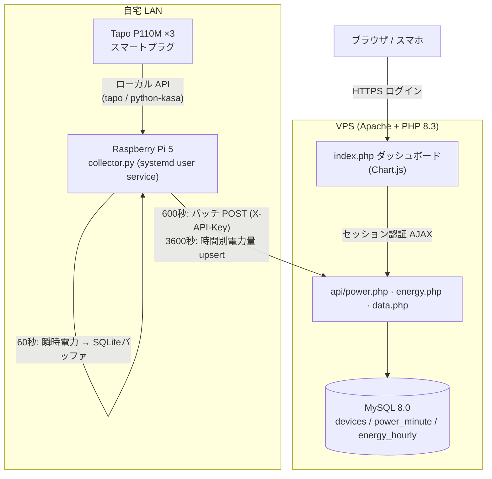

# tapo-power-monitor

TP-Link **Tapo P110M** スマートプラグの電力データを Raspberry Pi でローカル収集し、VPS 上の自作ダッシュボードで可視化するセルフホスト型の電力モニタリングシステム。

Tapo の公式クラウド API は非公開で、消費電力データはアプリからしか見られず書き出しもできない。本プロジェクトは**ローカル LAN 経由でプラグから直接データを取得**し、独自に蓄積してブラウザから閲覧・分析できるようにする。


## 主な機能

- **1分粒度の瞬時電力(W)収集** — LAN 内のプラグを毎分ポーリングし、電子レンジやコンプレッサの ON/OFF まで見える細かさで記録
- **欠損に強い電力量(kWh)** — プラグ本体が保持する時間別電力量履歴を毎時取得して upsert。収集側が一時停止しても時間別の値は後追いで補完される
- **無限スクロールのグラフ** — 瞬時電力チャートはドラッグでパン・ホイール/ピンチでズーム。左端に近づくと過去データを自動で遅延ロードし、いくらでも遡れる
- **推定電気代の表示** — 日別電力量に円換算(単価は設定可能)。左軸 kWh / 右軸 ¥ の二軸表示＋期間合計サマリー
- **DHCP でも止まらない IP 自動追従** — 接続失敗時のみ LAN discovery を行い MAC で機器を再特定。通常時はオーバーヘッドゼロ
- **ネットワーク断への耐性** — 送信失敗時はローカル SQLite にバッファして復旧後に再送(主キーで重複無害化)
- **認証付きダッシュボード** — パスワードログイン + Remember Me(90日)。スマホ・ダークモード対応

## アーキテクチャ



- **収集(raspi)→ API(server)** は HTTPS + `X-API-Key` ヘッダーで認証
- **ダッシュボード → データ API** はセッション認証(`data.php` は期間指定 `from`/`to` に対応し遅延ロードを支える)

## 技術スタック

| レイヤ | 使用技術 |
|---|---|
| 収集 | Raspberry Pi 5 / Python 3.11 / asyncio / [tapo](https://github.com/mihai-dinculescu/tapo) / [python-kasa](https://github.com/python-kasa/python-kasa)(discovery) / systemd user unit |
| バッファ | SQLite |
| API / バックエンド | Apache 2.4 / PHP 8.3 (mod_php) / MySQL 8.0 |
| フロントエンド | Vanilla JS / Chart.js 4 / chartjs-plugin-zoom / hammer.js |

## ディレクトリ構成

```
raspi/                     Raspberry Pi に配置する収集サービス
  collector.py             常駐サービス本体（asyncio、60/600/3600秒の3系統周期タスク）
  test_devices.py          プラグ導通テスト
  requirements.txt         Python 依存
  .env.example             環境変数サンプル（実 .env は .gitignore 済み）
  tapo-collector.service   systemd user unit

server/                    VPS に配置する PHP アプリ
  index.php                ダッシュボード本体（Chart.js）
  auth.php                 認証ガード（セッション + Remember Me）
  login.php / logout.php   ログイン / ログアウト
  api/
    db_config.php          DB 接続共通関数（getenv ベース）
    power.php              瞬時電力バッチ受信（X-API-Key、INSERT IGNORE）
    energy.php             時間別電力量受信（ON DUPLICATE KEY UPDATE）
    data.php              ダッシュボード用データ API（セッション認証、期間指定対応）
  sql/
    setup.sql              DB・テーブル・初期データ・アプリ用ユーザー
    setup_dashboard.sql    Remember Me トークンテーブル

docs/
  deploy.md                デプロイ手順（raspi 側・VPS 側・導通確認）
```

## ダッシュボード

| セクション | 内容 |
|---|---|
| 現在の電力カード | デバイスごとの現在 W と当日 kWh。30秒ごと自動更新、無応答はオフライン表示 |
| 瞬時電力チャート | 1h / 6h / 24h プリセット + ドラッグ pan・ズーム・**過去への無限スクロール(遅延ロード)** |
| 時間別 電力量 | 今日 / 7日の kWh 棒グラフ |
| 日別 電力量 | 30日の積み上げ棒グラフ + **推定電気代(左 kWh / 右 ¥ の二軸)** |

## 設計上のポイント / ハマりどころ

実装中に遭遇した非自明な点と対処:

- **P110M(JP) の TPAP 暗号化** — 新しめのファームウェアはローカル API に `tapo`/`python-kasa` で接続できず `FORBIDDEN` を返す。Tapo アプリの **マイページ → 音声アシスタント → サードパーティ互換性 を ON** にすると KLAP に切り替わり接続可能になる（アプリのバージョンによりメニュー位置が異なる）
- **一部個体のファームウェアで `HASH_MISMATCH`** — 特定 FW では互換トグルを入れても認証がずれる。トグルの入れ直し・再起動で直らない場合はアプリからの削除→再追加が確実
- **電力値の単位** — `get_current_power()` は W 直値、`get_energy_usage().current_power` は mW。サブワット分解能が取れる後者を採用（実機検証済み）
- **時間別履歴の API** — `get_energy_data(interval, start_date)` の結果は `.entries[].energy`(Wh)。旧来の `start_datetime`/`.data` とは異なる
- **MySQL 8 `only_full_group_by`** — ダウンサンプルの `GROUP BY 複合式` が拒否されるため、派生テーブルでバケット列を先に作ってから集約
- **Safari の日時パース** — `"YYYY-MM-DD HH:MM:SS"` を `new Date(str.replace(' ','T'))` で渡す
- **chartjs-plugin-zoom の `resetZoom`** — 初回レンダリング範囲に戻る癖があるため、プリセット切替では min/max を明示設定して update する
- **DNS 依存の低減** — 動的 DNS 名の一時的な解決失敗で送信が止まらないよう、収集側は VPS の固定 IP を `/etc/hosts` に固定するのが堅牢（データ自体はバッファ→再送で保護される）

## セットアップ

詳細は [`docs/deploy.md`](docs/deploy.md) を参照。概要:

1. **Raspberry Pi**: `~/tapo/` にコード配置 → venv 作成 → `pip install -r requirements.txt` → `.env` 作成(chmod 600) → systemd user unit を enable
2. **VPS**: `setup.sql` / `setup_dashboard.sql` で DB 構築 → `server/` を配置 → Apache の `SetEnv` で API キー・DB 接続情報・ダッシュボードパスワードを設定 → reload

> リポジトリ内の `.env.example` / `setup.sql` のドメイン・IP・MAC はプレースホルダです。自分の環境の実値に置き換えてください。

## 設定（主な環境変数）

| 変数 | 場所 | 用途 |
|---|---|---|
| `TAPO_EMAIL` / `TAPO_PASSWORD` | raspi `.env` | Tapo アカウント認証 |
| `API_KEY` / `TAPO_API_KEY` | raspi `.env` / VPS Apache | 収集 API の共有キー（英数字のみ推奨） |
| `DEVICES` | raspi `.env` | `device_key:ip:mac` のカンマ区切り |
| `TAPO_DASH_PASSWORD` | VPS Apache | ダッシュボードのログインパスワード |
| `TAPO_YEN_PER_KWH` | VPS Apache | 電気代の単価(円/kWh)。未設定時は 36 |

## ライセンス

個人プロジェクト。特に指定のない限り MIT 相当の自由な利用を想定。
